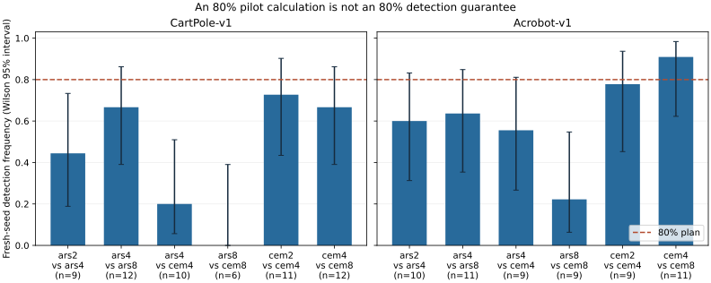

# seed-power

I test whether pilot-based seed budgets deliver their promised detection rate in reinforcement learning.

**Question:** how many independent training seeds does a comparison need, and does planning that count from a small pilot work?

I use established power calculations—not a new formula—and adapt MIT affine ARS/CEM from [control-clock](https://github.com/mottopanikeiku/control-clock). [stats.py](src/seed_power/stats.py) plans the count; [training.py](src/seed_power/training.py) runs independent policies; [analyze.py](scripts/analyze.py) checks fresh-seed outcomes.

**Result:** plans targeting 80% power detected a difference in **67/119 comparisons: 56.3%**, with a descriptive Wilson 95% interval of **47.3–64.9%** ([summary](results/summary.json)). These are repeated, short-budget CartPole/Acrobot comparisons, not a general estimate of deep-RL power.

## What the pilot promised, and what happened

I fixed six different-variant comparisons per task and repeated each with disjoint eight-seed pilots per arm. The variants change ARS/CEM iteration counts or compare the optimizers. Each policy score averages sixteen evaluation episodes; episodes are **not** additional training seeds ([design](configs/design.json)).

I committed and pushed the complete [pilot plan](results/pilot_plan.json) at [`49c21ed`](https://github.com/mottopanikeiku/seed-power/commit/49c21edbc34ea43ab1804a85e7e9269d534abc65) before confirmation. I then trained **11,440 fresh seeds**, separate from **2,688 pilot seeds**, on Modal CPU containers ([raw confirmation](results/confirmation/runs.jsonl), [raw pilot](results/pilot/runs.jsonl), [environment](results/confirmation/environment.json)). Every executable plan received its exact requested count.

| Task | Executable different-variant plans | Fresh-seed detections | Median seeds per arm |
|---|---:|---:|---:|
| CartPole-v1 | 60 | 30/60 (50.0%) | 15 |
| Acrobot-v1 | 59 | 37/59 (62.7%) | 25 |

[All counts, intervals and per-comparison outcomes](results/summary.json). Of 144 attempted different-variant plans, 119 were executable; **25 required more than the predeclared 256-seed-per-arm limit** and were not run. I did not truncate their counts while calling them 80% plans. Eligible counts had median 19 and interquartile range 10.5–48.5 seeds per arm. Seven detections reversed the pilot's direction. Separate same-variant controls rejected in 1/17 tests; that small sample cannot establish exact type-I calibration.



[How pilot gaps transferred](figures/pilot_transfer.svg) · [Protocol and interpretation](docs/PROTOCOL.md)

The planner treats noisy pilot gaps and variances as population values. Its equal-variance Gaussian calculation is pooled-t power; for the actual Welch test, holding degrees of freedom fixed is an approximation even when population variances match. These bounded, skewed RL returns need not satisfy the model. Some different-variant comparisons may have no true mean difference. The result is **detection frequency for this fixed design**, not power at a known effect or proof that all failures came from pilot noise.

## How many seeds?

Illustrative two-sided α = 0.05, 80% power, equal-variance Gaussian scores. Standardized difference means the mean gap divided by the common standard deviation ([calculations](results/public_standardized.csv)):

| Standardized mean gap | Seeds per algorithm |
|---|---:|
| 0.2 | 394 |
| 0.5 | 64 |
| 0.8 | 26 |
| 1.0 | 17 |

I also reanalyse **140 released runs** from my public Control Clock benchmark: five implementations on two tasks. **19/20** unordered task/implementation pairs have below-80% *plug-in model power for their observed gaps* ([data and license](data/public_sources.json), [audit](results/public.json)). Those are stopping-policy returns on a reused evaluation set—not equal-budget scores, true power, or a survey of published RL papers. The rliable Atari score route returned 404; I make no Atari claim.

## Reproduce

Recompute the committed results with CPU-only Python; no training or paid compute is required. Fresh training used one numerical thread per Modal CPU container, with at most eight containers and 1 GiB each. Total conservative cloud cost, including failed initialization, was **$0.0221, rounded up to $0.03**, not an audited invoice ([cost](results/cost.json)).

```sh
uv sync --locked --python 3.12
uv run python scripts/public_analysis.py && uv run python scripts/analyze.py confirmation && uv run python scripts/figures.py
uv run python scripts/plan.py --effect 0.5 --sd-a 1 --sd-b 1
```

[Cloud rerun and tests](docs/RUNNING.md). Fix a meaningful effect before seeing results; using a pilot only for variance avoids estimating that target, but does not guarantee power.

## Limits and prior work

- Two cheap tasks and affine policy search, not neural-network deep RL.
- Counts over the limit are excluded; the achieved rate is conditional on executable plans.
- Twelve repeats per comparison leave wide intervals; pooled intervals are descriptive for heterogeneous cells.
- Fixed iteration budgets are not equal environment-step budgets.
- The historical audit is one owner-authored release with stopping-selected scores.

[Henderson et al. 2018](https://arxiv.org/abs/1709.06560), [Colas et al. 2018](https://arxiv.org/abs/1806.08295), [Agarwal et al. 2021 / rliable](https://arxiv.org/abs/2108.13264), and [Patterson et al. 2023](https://arxiv.org/abs/2304.01315v1) already establish seed-count and evaluation guidance. The addition here is the committed, prospective calibration test, not statistical novelty. [Prior-work and license details](docs/PRIOR_WORK.md). Code is MIT; third-party notices are retained.

Written with AI coding assistance.
