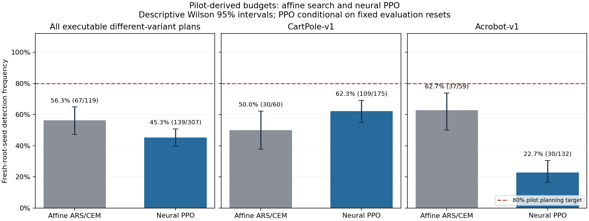

# seed-power

I planned neural PPO comparisons for **80% modeled power** from eight-seed pilots, then ran every executable plan on fresh training seeds: **139/307 detected a difference (45.3%)**, with a descriptive Wilson 95% interval of **39.8–50.9%**. My earlier affine ARS/CEM experiment detected **67/119 (56.3%; 47.3–64.9%)**. These are detection frequencies in two fixed classic-control designs—not true power at known effects.

| Fresh-seed detections | Affine ARS/CEM | Neural PPO |
|---|---:|---:|
| All executable different-variant plans | 67/119 (56.3%) | 139/307 (45.3%) |
| CartPole-v1 | 30/60 (50.0%) | 109/175 (62.3%) |
| Acrobot-v1 | 37/59 (62.7%) | 30/132 (22.7%) |



[Neural summary](results/neural/summary.json) · [Every test](results/neural/outcomes.csv) · [Original summary](results/summary.json) · [Vector figure](figures/neural_vs_linear.svg)

## What I built

I adapt MIT [Control Clock PPO](https://github.com/mottopanikeiku/control-clock/blob/b090dad8a3b53f937782676c6033ba3557cedfa1/control_clock/jax_ppo.py), inspired by Apache-2.0 PureJaxRL. Actor and critic each have two 32-unit tanh hidden layers. Each root owns its parameters, Adam state, rollout randomness, advantage normalization and gradient clipping; I compile a `vmap` across independent roots on one L4 ([implementation](src/seed_power/neural.py)).

Every seed trains exactly **32,768 CartPole** or **65,536 Acrobot** environment transitions, without qualification stopping. Its score averages sixteen deterministic-argmax evaluation episodes on fixed task-specific reset seeds shared across variants and phases. I count only each first episode, ending at termination or 500 steps. Episodes are measurements, **not sixteen training replicates**; inference is conditional on these reset sets.

Durable GPU batch files, source/runtime-versioned caches and bounded fresh-client retries preserve completed results across interrupted exports ([runner](neural_modal.py)).

## What the pilot promised

I compare base PPO with faster/slower learning rates, two rather than four update epochs, and zero rather than 0.01 entropy coefficient. Each pair gets **50 repetitions** with independent eight-seed pilots per arm; same-variant controls are separate. I selected fifty from cloud training throughput before statistical pilots.

I pushed the complete uncapped [count plan](results/neural/pilot_plan.json) at [`260bebb`](https://github.com/mottopanikeiku/seed-power/commit/260bebb4b1ab2d827ef06371b3681a0293f2b999) before confirmation. **8,000 pilot roots** and **65,744 fresh confirmation roots** represent **3.90 billion training transitions** in the published neural data ([raw pilots](results/neural/pilot/runs.jsonl.gz), [raw confirmation](results/neural/confirmation/runs.jsonl.gz), [environment](results/neural/confirmation/environment.json)). Every executable plan received its exact requested count.

**93/400** different-variant plans exceeded the predeclared **512-seed-per-arm** limit; I retain their requested counts rather than truncate them and advertise 80% power. Executable counts had median **37**, interquartile range **4–120.5**. Twenty detections reversed the pilot's direction. Per-comparison detection rates ranged **2.9–94.0%**.

Same-variant controls rejected in **7/74 tests (9.5%; 4.7–18.3%)**; CartPole alone rejected in **5/36 (13.9%; 6.1–28.7%)**. I do not claim exact 5% calibration. All 381 completed tests used ordinary Welch calculations, with no constant-group conventions triggered.

[Per-comparison figure](figures/neural_comparisons.png) · [Neural protocol](docs/NEURAL_PROTOCOL.md) · [Original protocol](docs/PROTOCOL.md)

## Interpretation, not overclaiming

The noncentral-t planner plugs in noisy pilot gaps and variances and holds Welch degrees of freedom fixed. This approximates the actual sample-based Welch test—even with equal population variances. Bounded, skewed RL returns need not satisfy its model. Different variants may have no true mean gap; pooled intervals describe heterogeneous fixed cells, conditional on executable plans. I cannot attribute every missed detection to pilot noise.

The experiments differ in optimizers, horizons, budgets, reset handling, precision and comparison mix. Their rate difference is **not a causal effect of neural policies**. Two classic-control tasks are not a general deep-RL benchmark.

## How many seeds?

For an illustrative equal-variance Gaussian pooled-t model, two-sided alpha=0.05 and 80% power:

| Standardized mean gap | Seeds per arm |
|---|---:|
| 0.2 | 394 |
| 0.5 | 64 |
| 0.8 | 26 |
| 1.0 | 17 |

My separate [140-run historical audit](results/public.json) puts **19/20** Control Clock pairs below 80% plug-in model power for their observed gaps. Those are stopping-selected scores, not true power or an RL-paper survey.

## Reproduce

Recompute from committed scores without training or paid compute:

```sh
uv sync --locked --python 3.12
uv run python scripts/neural_analyze.py confirmation
uv run python scripts/neural_figures.py
uv run python scripts/analyze.py confirmation
uv run python scripts/public_analysis.py
```

Conservative cloud compute estimates, including failed attempts: **$1.1905, rounded up to $1.20**, for neural work; **$0.0221, rounded up to $0.03**, for the original experiment. These are not audited invoices and exclude recurring Volume storage ([neural cost](results/neural/cost.json), [original cost](results/cost.json)). [Cloud reproduction and tests](docs/RUNNING.md).

I use established seed-count guidance, not a new formula: [Henderson](https://arxiv.org/abs/1709.06560), [Colas](https://arxiv.org/abs/1806.08295), [Agarwal/rliable](https://arxiv.org/abs/2108.13264), [Patterson](https://arxiv.org/abs/2304.01315v1). [Attribution and licenses](docs/PRIOR_WORK.md). Code is MIT; third-party notices are retained.

Written with AI coding assistance.
